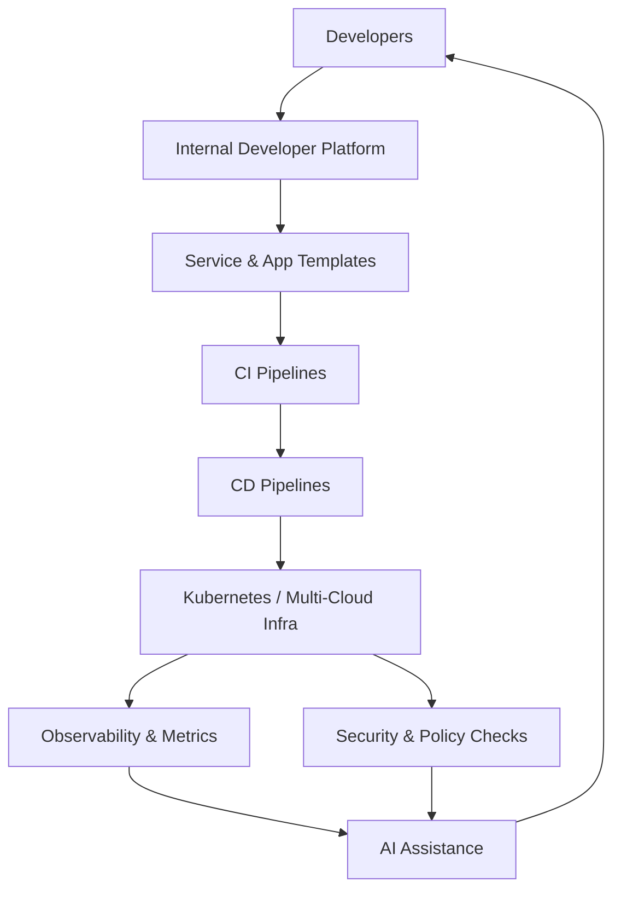

# 02-platform-engineering-idp
# Platform Engineering & Internal Developer Platform (IDP) Portfolio

This repository demonstrates **building an Internal Developer Platform (IDP)** to enable teams to **self-service infrastructure and applications** while maintaining **governance, security, and observability**.

It is part of my **Platform Engineering Portfolio**, showcasing production-grade platform design, templates, and automation for enterprise-scale environments.

---

## 📌 Goals

- Provide **self-service platform for developers** (standardized templates, CI/CD pipelines, environments)
- Reduce **operational toil** and manual intervention
- Ensure **security, compliance, and auditability by design**
- Promote **faster feature delivery** through automation
- Integrate **observability and optional AI-assisted insights** for reliability

---

## 🗺️ Diagram: IDP Reference Architecture



---

## 🗂 Repository Structure

```text
02-platform-engineering-idp/
├── templates/            # Service & application templates (Helm, YAML)
├── pipelines/            # CI/CD pipeline definitions (Jenkinsfiles, GitHub Actions)
├── environments/         # Environment-specific configurations
│   ├── dev/
│   ├── qa/
│   └── prod/
├── idp-scripts/          # Scripts to bootstrap and manage IDP services
├── security/             # Policy-as-code examples (OPA, Trivy, Vault)
├── observability/        # Monitoring configs & dashboards
├── ai/                   # Optional AI scripts for automation
└── README.md
```

---

## 🌟 Key Features

| Feature | Description |
|---------|-------------|
| **Self-Service Templates** | Standardized app + infra templates for developers |
| **Automated CI/CD Pipelines** | Pre-configured pipelines for apps |
| **Environment Provisioning** | Dev/QA/Prod configurations ready to use |
| **Security & Compliance** | Policy-as-code enforcement |
| **Observability Hooks** | Built-in metrics & dashboards |
| **Optional AI Assistance** | LLM-based automation & failure insights |
| **Audit & Governance** | Traceable deployment and platform actions |

---

## 🔹 Benefits

- Faster onboarding for new developers and teams  
- Reduced human errors in deployments  
- Consistent platform usage across multiple teams  
- Enables **enterprise-scale automation**  

---

## 🏁 Next Steps

1. Add sample **service templates** in `templates/`  
2. Configure **CI/CD pipelines** in `pipelines/`  
3. Add environment-specific configurations (`environments/dev`, `qa`, `prod`)  
4. Integrate **security and observability hooks**  
5. Optional: add **AI-assisted automation scripts** in `ai/`  
6. Include **architecture diagrams / screenshots** for demos
